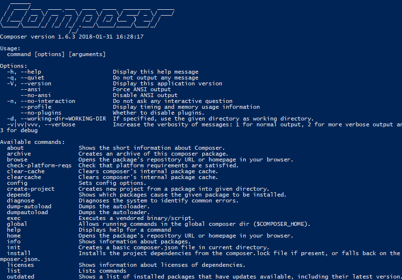
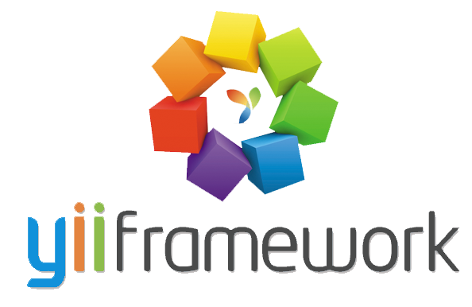
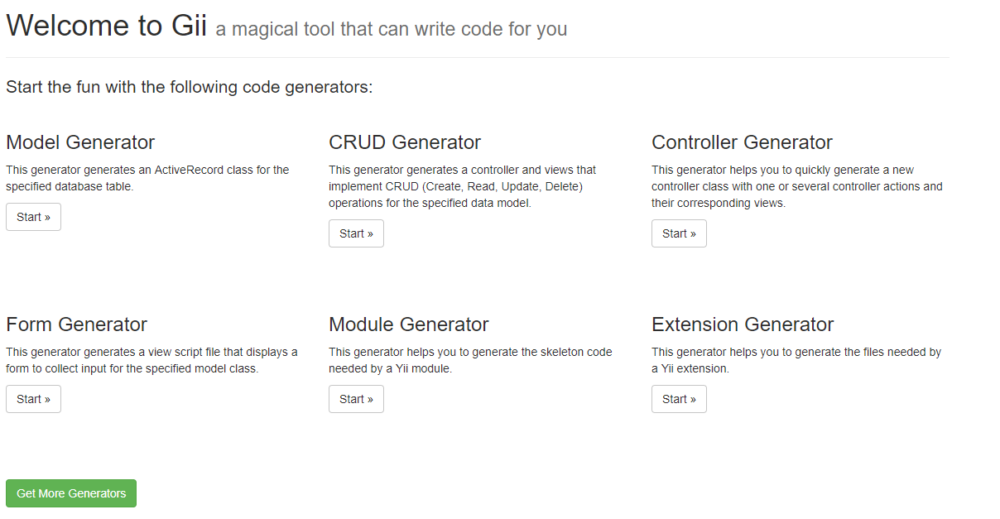
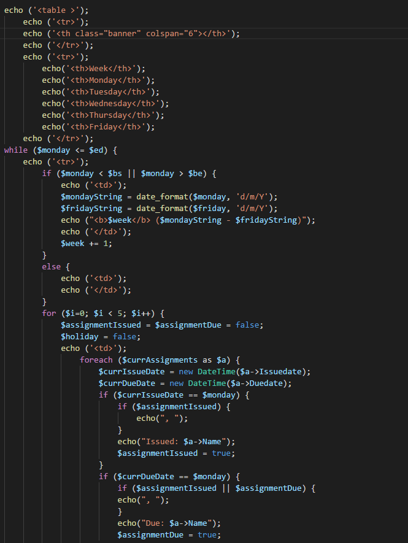
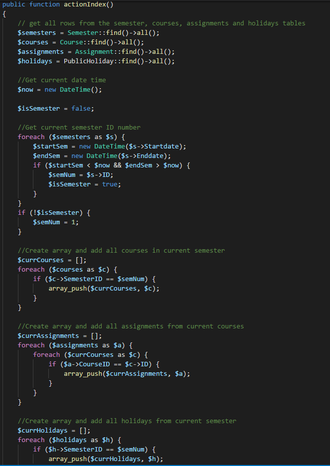
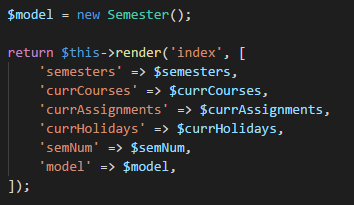
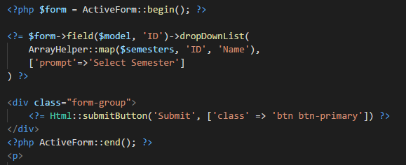
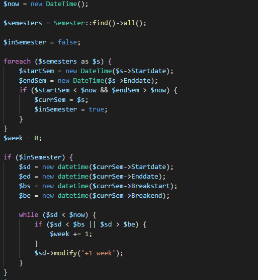
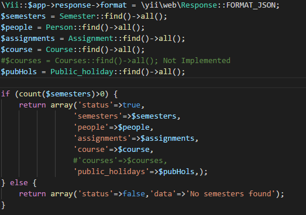

[Timeline](index.md) | [Technical Proficiency](technical.md) | [Professional Proficiency](professional.md) | [CV](cv.md)

# Technical Proficiency

## Used gitlab as a version control

We used gitlab as our version control for this project, I created the project on my account and gave all the group members master permissions so they could pull and push all their work to it.  This worked really well and we only had a couple of merge problems which were caused by the same person putting up their work twice me included.  I pushed some work from polytech and from home that edited the same file differently but I used Visual Studio Code's inbuilt merge helper to sort through the error and keep the code I wanted and get rid of the code I didn't.

## Getting Elise's original semester tracker to work on the Kate server

When we got put into the semester tracker project Elise gave us the files she had made in a attempt to make her own, I spent a class uploading these to Kate and creating a database which used the same layout she had on phpmyadmin.  I only managed to get the front page working without any css applied to it, we used this in the beginning to get a feel for what the software should look and feel like(links and information shown).

## Composer

At the very beginning I tried to download and get Yii to run on my computer however the YiiFramework site pointed at an application called composer which allowed you to download Yii and extensions such as codeception.  The first roadblock I had was when installing composer you needed to point at a current version of PHP and I couldn't find the location of the php.exe file, it turned out I could find this in the WAMP or MAMP folder.  Once I had installed composer I didn't realise that there is no gui and it is all done from the command prompt and needed to be pointed at globally by adding it to the computers PATH.

## Learned a new framework Yii
At the beginning of the project we were prompted by our client(Elise) to considering going with Yii as a framework for our software instead of coding it in straight php like the original files we were given from Elise, who had already had an attempt at making a semester tracker.  I spent a couple of weeks delving into Yii beginning by creating my first website powered by the Yii framework using a basic template found on their site, after doing that I spent the rest of the week looking through all the folders and files in the template models, views, controllers etc.

## Created Yii template hosted locally on MAMP/WAMP
To get my Yii project to run I had to run it on a server, I chose to use a local server hosting software WAMP which I downloaded at home.  This was quite confusing at first and I had some trouble connecting to the phpmyadmin database that came with the software, which turned out I needed to configure the db.php file in the config folder of the site to use the username and password it was automatically setup with root/root.  However when I tried to use the project on the polytechnic computers they didn't have WAMP, I found that MAMP was installed on the computers and then had to play around with and learned that software, after configuring the document root the web server was pointing at I was able to run and view the project allowing me to do work at the polytech.

 

## Learned how to create models(active records) and controllers using the gii module
Once we had a working site and a database setup with tables, I then needed to find a way to get that data and display it on the website.  This turned out to be easily done with a built in module Gii which allowed to you to generate active records for the models in the database which give you easy access the display and change the data.  Gii also allows you generate controllers, forms, modules, extensions and make CRUD to create, read, update and delete data in each model.

## Created the view to display semesters in a table

I created a new index view for semester which I generated with gii, I then imported the model for semester into the view and pulled all data out of those tables.  Putting all information into a table and and displaying all week start dates with week numbers, skipping over holiday rows and later in the semester I added assignments or holidays displaying beside the given week they occured in.  I later changed this to display each week and date ranges (monday to friday) and a column for each day, displaying if there is a assignment assigned or due on that day or if there is a holiday.

## Created a controller to get semesters, assignments and holidays, which is then passed to a view

I had written all the logic in the view which led to a lot of code repetition and made it hard to expand on the code and add extra features, so I spent a week looking into generating a controller with Gii and using that to pull all the information I needed out of the database and sorting it the way I needed it.  I then passed all the data and extra variables I had created (like a variable to track which semester we were currently in) into the view, this cleaned up the view and made it a lot more readable.  Later on in the semester we needed to add assignments and holidays so I pulled their data out of the models in the controller and also passed them to the view, because I had cleaned the code this was a very quick and easy process and kept the logic that I added out of the view code.

## Created a dropdown which allows you to select different semesters

Getting a dropdown to allow the user to choose which semester was being displayed took me a while to get working, this was especially hard because Yii uses its own layout for forms which required a model to be passed from the controller and used to create the dropdown with the help of the built in arrayhelper and mapping functions.  The main problem I had with this was that the model needed to be a new empty model of the semester and I was passing it all the data from the semester model, once I had fixed this I pretty much had it all working only needing an extra field in the database table to show what would appear in the dropdown (e.g. Semester 1 - 2018).

## Coded the landing page to display current day and week in the current semester

I ended up coding this mainly using pure php functions to find the current semester, after pulling all semesters out of the database I had to foreach through them to find the current semester we were in with the use of the DateTime object and getting the current date.  Once I had the current semester I had to go through that with an incrementing count to find the current week, getting the current day just required formatting of the already obtained current DateTime.

## Created an api which access and shows all data in the database in json format

This took quite a lot of time because I struggled quite a bit to begin with to find some good documentation or resources that told me how to accomplish this in Yii.  It required use of the module generator in Gii which we had not used in the project so far and making a brand new controller and view which access the database, the code to convert the data into json took me a while to find, I ended up finding it in a 20 minute youtube video with no talking, only text written in a text editor with less than 15000 views.  I also wrote the code to create a new entry in the database for semester, but after talking Adon he only wanted read access so I didn't include it.

## Codeception

Codeception is Yii's inbuilt automated testing software which you can run unit, functional and acceptance tests through.  I looked into this for a long time and manage to download all dependencies through composer for it, however after a lot of fiddling I could only manage to run the tests from the vendor folder which holds the Yii Framework, this meant that I didn't have access to the models or views so I couldn't test anything in the site.  If I tried the same thing in the premade tests folder of the site I kept getting a Catchable fatal error, this was because an argument being passed into the test listener wasn't an instance of PHPUnit_Framework_TestListener.  I spent multiple days trying to fix this error but to no avail, having a lot more work on the site that needed done I had to stop trying to make this work.  I asked the rest of the group and a couple of them had been playing around with it too but none of them could get it to work properly either.

## Learned how to use github pages and jekyll to make this portfolio

The last technical skill that I learnt was how to set up a static website created with jekyll and hosted on github pages, this required me to learn the github pages markdown which has shortcuts that convert to html when run.  For example, the # surrounds the following text with h1 tags and similiarly ## makes h2 and this keeps going up to h6.  I imported the midnight theme and edited the default html document and css to edit how the site looked, adding content through github and commiting it to the repo which would then display on the site.
